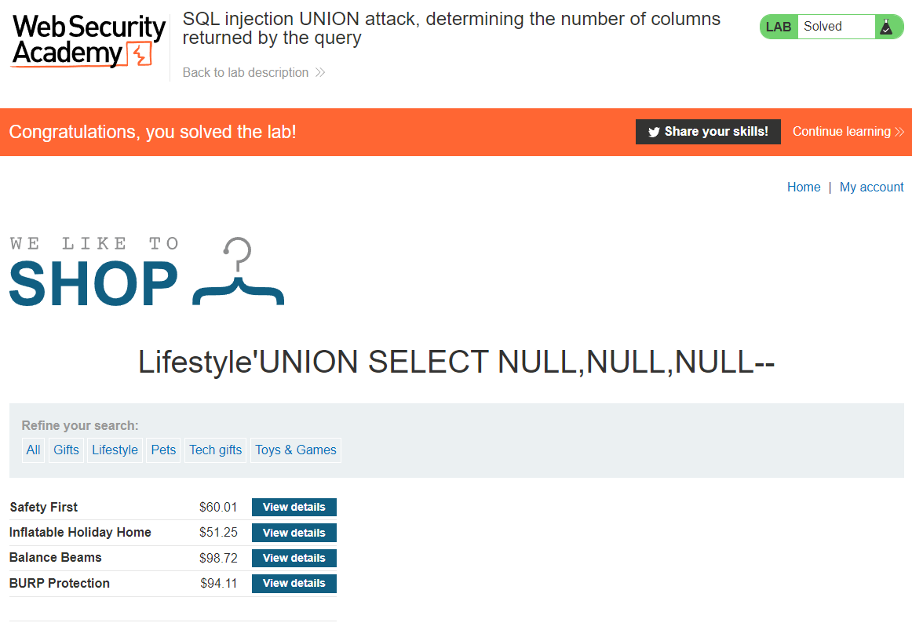

## LAB 1: SQL injection UNION attack, determining the number of columns returned by the query
[SQL injection UNION attack, determining the number of columns returned by the query](https://portswigger.net/web-security/sql-injection/union-attacks/lab-determine-number-of-columns)  
**LEVEL**: PRACTITIONER  
**Description**: This lab contains an SQL injection vulnerability in the product category filter. The results from the query are returned in the application's response, so you can use a `UNION` attack to retrieve data from other tables. The first step of such an attack is to determine the number of columns that are being returned by the query. You will then use this technique in subsequent labs to construct the full attack.

To solve the lab, determine the number of columns returned by the query by performing an SQL injection UNION attack that returns an additional row containing null values.

## Solution

1. We need to determine the number of columns in the table
2. We need to return NULL fields

### 1. Determine the number of columns in the table
Using `ORDER BY` we can determine the number of columns in the table. `ORDER BY` sorts a table by a given column index. We can increment the column number by one until we get an error which will tell us that the previous number is the number of columns in the table. 

Trying the following parameters
`' ORDER BY 1--`
`' ORDER BY 2--`
`' ORDER BY 3--`
`' ORDER BY 4--`

On the last paramter where we order by 4 we get the following error `Internal Server Error` which is a 500 internal error. This means the number of columns in the table is 3.

FULL URL: `https://ace81f571f5d51b4c0d385d1000b00ae.web-security-academy.net/filter?category=Lifestyle' ORDER BY 4--`

### 2. Return NULL feild
We can now use `UNION` attack to return NULL fields, we need to return null for each column.

`' UNION SELECT NULL,NULL,NULL--`

FULL URL: `https://ace81f571f5d51b4c0d385d1000b00ae.web-security-academy.net/filter?category=Lifestyle' UNION SELECT NULL,NULL,NULL--'`

<!-- EOF -->